# hiroglpyhics sign detection
## a quick heads crash course on hiroglpyhics signs

hieroglyphs are signs used by ancient egyptians as thier system of writing this signs where made of symbols resembling thier usual day objects like 

- animals 
- farm tools
- house tools
- human parts like hands and feet 

with numbers usually represented by a system of thier own as they where used to manage logistics .

these signs can be found on all the monmuemnts and walls of ancient egypts from tombs to temples to old houses and payprus papers like the notoruis book of the dead which is written in this system 

## writing oreintation 

like our modern writing systems the symbols (letters) must follow a direction of writing to avoid confliction with other words excluding palindroms to get a word right it must be read from the right direction love read backwards is evol (p.s love is actually not evil )

 so modern writing systems all follow a direction of writing latin languages are written from left to right while arabic and semetic langagues are written from right to left. 

strangely enough this old langauge follow are more complex system of writing where the direction can vary it can either be written from left to right or from right to left , even more strangely it can be written in a horizontal manner or a vertical manner 

## detecting oreintation 

luckily these guys were smart enough to avoid confusion when sharing letters in diffrent writing oreintation to come up with a system to detect the direction .

1. the start of the line is detected by the direction the letters are pointing to
2. the paragraph is divided into sections either by horziontal lines or vertical ones

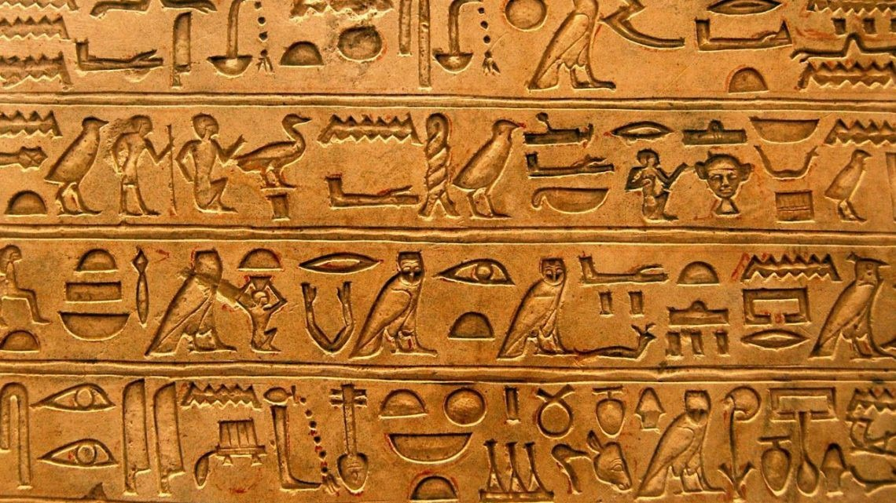
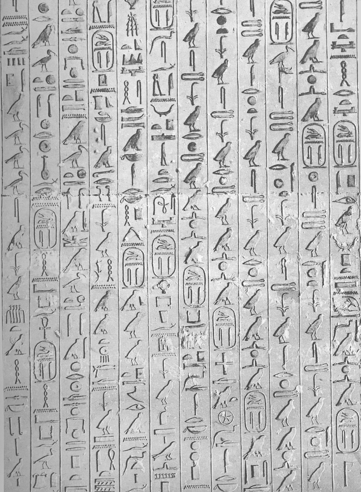

in both these images you can see that the writing direction starts from right to left but one is read from top to down and one from right to left each segment is a line and must be read before going to the other line 

## the challenges 

to take on a task we must first define our objectives we need to achive in order to fulfuil these task 

#### first we define our final output

the output of our script will usually pass to another classifcation layer usually (deep learning neural network) and we will need to pass each symbol indivdually , and in a sorted manner on the basis of the writing direction becuase the output of the classficaiton layer will pass to a nlp processor to translate it 

in short words we need a sorted array of symbols so we need to do these steps

1.determine the writing direction 
2.determine the writing oreintation 
3. detect each symbol effectively 

### our approach 

#### 1- determine the writing direction 

this can be achived using a mask to search for common letters and detect thier orientation or it can be done in the classfication layer 

doing it in the classfication layer is the easier choice but the doing it with image proccessing can be done and can be marked as further goal for this repo 

#### 2- determine the writing oreintation 

this can be easily achived by line detection algroithms the most commonly used one is hough transform which we used 

#### 3- detect each symbol effectively 

this can be done by using opencv algorithms which we implemented in this script 

### a quick recap about how the script work 

#### pre processing the image

first of all the script works on computer vision and image processing principles first of all to take on the task of detecting anything the image must be in a suitable condition so certian image processing techniques must be used in order for our algorithms to work 

- image sharpness filter
- image noise removal filters
- image restoration fitlers 
- image threshholding filters 

all these filters are build in opencv and skiimage which i recommend for anyone intrested in doing image processing work

so lets say after we start with this image

after applying the noise removal filters and turning it into greyscale we use threshholding filter to turn it black and white 
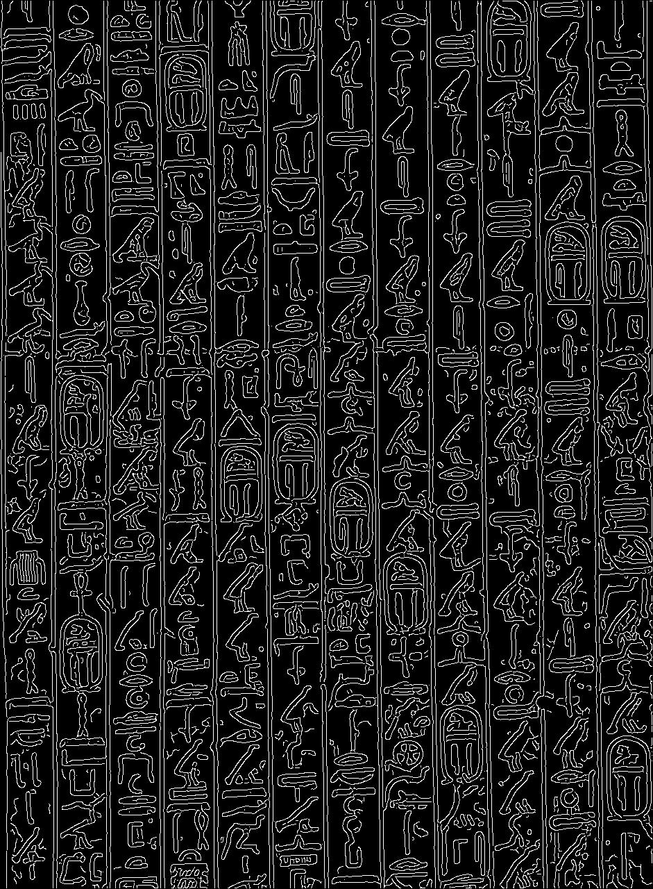

you may ask yourself why is that necessary .

well for start you can notice that the back ground is removed leaving us with the symbols and very lucky for us the (!!! lines !!!) and an extra good point for us that the lines are now zeros in an array full of ones which makes the line detection algorithm life alot more eaiser (and accurate)

#### detecting the lines 

after that we take our black and white image and send it to the algorithm to do it's work but a problem arises 

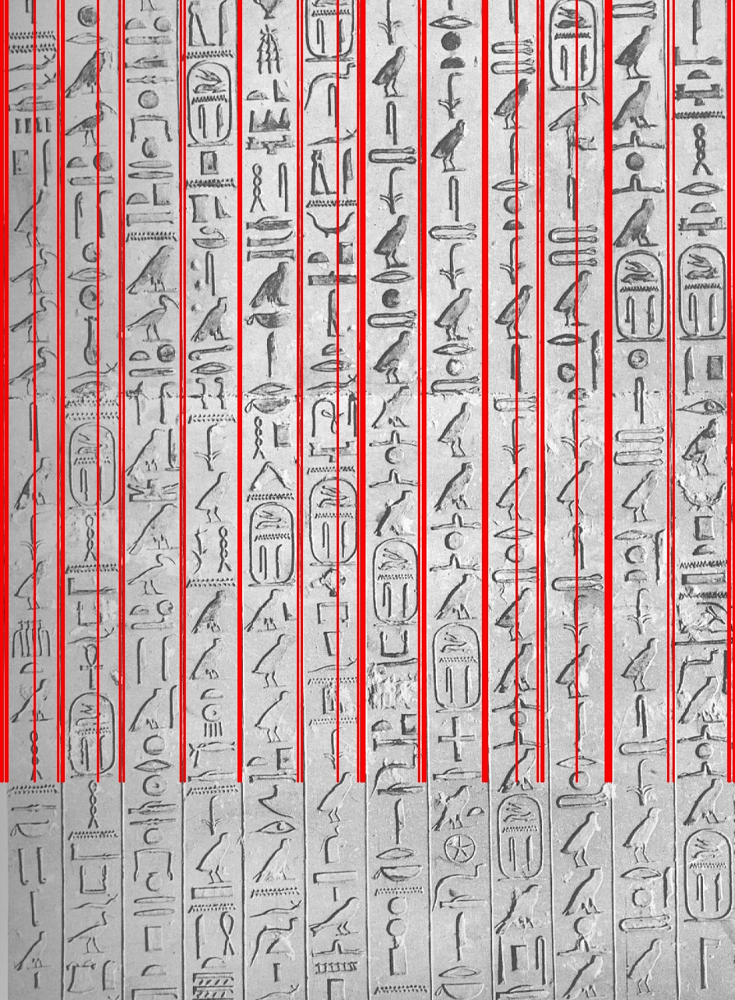

as you can see even after our efforts the line detection algorithm is not fully accurate as the result on our hands are multiple lines with some of them totally wrong 

such we are presented with a new challenge to add to our notebook even though it's a minor one which is to finetune the algorithm output 

#### finetuning the lines 

using simple mathematics we can group lines by proximty and use thier x,y coordinations to get thier average . why whould that help ?? 

because the average passes right in the middle which the statistical assumption that the average of almost correct answers is the right answer 

following this math formula it turned out that you should always have respect for your school math teacher 

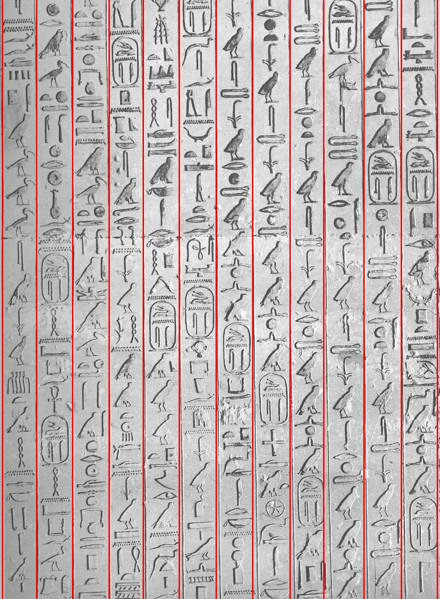

#### segmenting the original photo

using these lines we then can proceed to cut the image into segments where each segment can be proccesed to detect and extract the symbols 

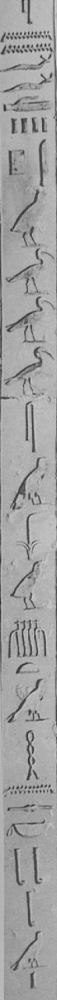 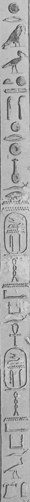 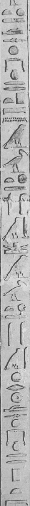

as you can see we have all the symbols nearly fully intact to work upon 

#### threshholding the image 

we then use the thresholding filter as we need to produce better results for sign detection to work 

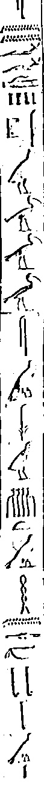

#### contour detection 

this image is then passed to opencv find contours library which returns to us an array of boxes around the symbols 

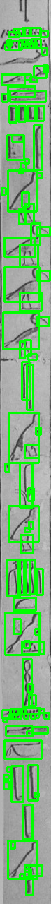

as you can see sadly we still have to work on the output of these algorithm 

#### fine tuning the contours 

as you can see in the last image there are quite a few of wrong answers to our question 

1. noise being detect as symbols
2. multiple boxes around the same symbol
3. smaller boxes in the symbol box 

this like the line problem is a geometrical one so before we take on the problem we must define it's math formula 

#### the math formula 

##### 1. noise being detected as symbols 
this can eaisly be done be defining a threshold based on the image resoultion that the symbols must pass to not be considerd noise 
##### 2. multiple boxes around the same symbol
to solve this question we must first make an assumption 
1. that the symbol is divided into smaller intersecting boxes which can be combined to get the correct detection of the symbol 
2. that the intersection must pass a certain threshhold so that near symbols does not get joined as one 

##### 3. smaller boxes in the main box 

that means that the smybol box contains noise which was wrongly detected by the opencv algorithm we can almost surely assume that the bigger box enclosing the smaller one containes the write answer this leads us to the assumption that deleting smaller boxes in the bigger box would imporve our accuracy 

##### finally using what we have learned from our analysis we can decide to do a number of things we remove very small boxes, we join intersecting boxes which pass a certian threshhold , and we remove smaller boxes in the bigger box 

#### applying the math formula 

after writing the code of the math formula into python function we can use them on the image an see the result for our self 

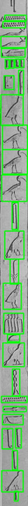

and as you can see math again got it right 

### final conculsion 

we have arrived into a final result which can be safely passed into the classfication model i must confess it does not achive the desired 100% accuracy but there is always room for improvment you can read the python script for your self each function is written in a simple and easy manner (if you know your math xD) and can be easily and quickly run in google colab in this repo you will find a sample output of this script i hope you find it interseting and if you have any question about it feel free to email me 

mohammedfathyzaky@gmail.com
